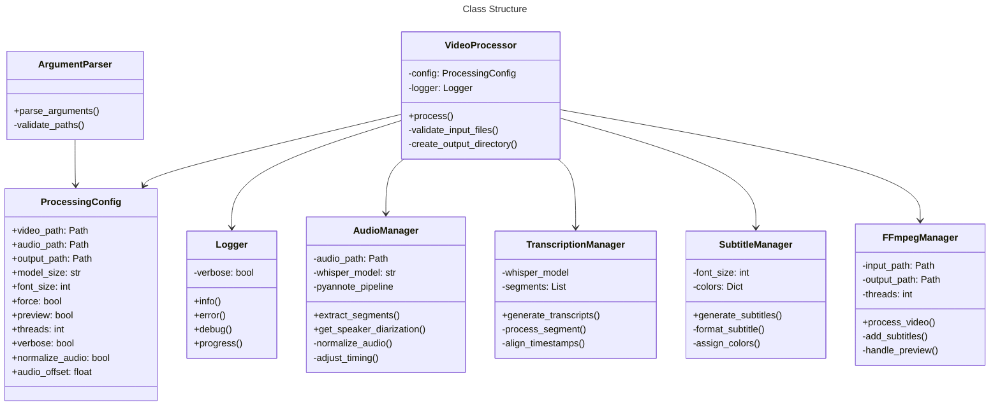

# Video Processing Tool with Speaker Diarization

A command-line tool that processes video files with advanced speaker diarization, transcription, and color-coded subtitle generation. This tool combines FFmpeg, OpenAI Whisper, and Pyannote.audio to create enhanced video content with speaker-identified subtitles.

## Features

- Speaker diarization using Pyannote.audio
- Speech-to-text transcription using OpenAI Whisper
- Color-coded subtitles based on speaker identification
- Customizable font styles and subtitle appearance
- Preview mode for quick testing
- Multi-threaded processing support
- Audio normalization and timing adjustment options

## System Architecture

### Processing Pipeline

The following flowchart illustrates the main processing pipeline:


### Class Structure

The application is built using the following class structure:



## Project Structure

```
project/
├── __init__.py
├── main.py
├── config/
│   ├── __init__.py
│   ├── argument_parser.py
│   └── processing_config.py
├── core/
│   ├── __init__.py
│   ├── video_processor.py
│   ├── audio_processor.py
│   └── ffmpeg_manager.py
├── utils/
│   ├── __init__.py
│   └── logger.py
└── tests/
    ├── __init__.py
    ├── test_audio_manager.py
    ├── test_transcription_manager.py
    └── ...
```

## Installation
```bash
# Clone the repository
git clone https://github.com/fetafisken00/brainrot.git
cd brainrot

# Create and activate conda environment from yml file
conda env create -f environment.yml
conda activate brainrot
```
You must have ffmpeg in your path.
Also you need to run it with administrative privileges, or create a pull request with a check for linux and use that.

Note: you need to be able to use admin with conda environment this might be an issue if its not in path(?), sudo is an option but idk what else you can use if you dont want to put in path.

Also create huggingface account and create key https://huggingface.co/pyannote/speaker-diarization-3.1
put it int .env, if no .env run program once.
## Usage

Basic usage:
```bash
python main.py -v input_video.mp4 -a input_audio.wav -o output_video.mp4
```

## Dependencies

- FFmpeg
- OpenAI Whisper
- Pyannote.audio
- Python 3.8+

## License
Haha, funny joke

## Contributing
?